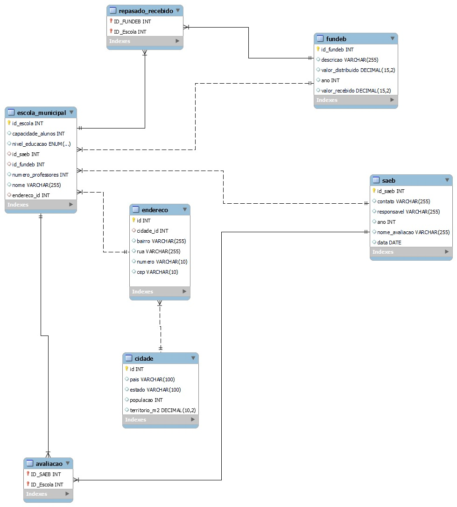

# SENAC_PROJETO-INTEGRADOR-III-09-2024
IMPLANTAÇÃO DE BANCO DE DADOS

AVALIAÇÃO DO ENSINO BÁSICO NOS MUNICÍPIOS BRASILEIROS

Este projeto “Avaliação do Ensino Básico nos Municípios Brasileiros” está sendo desenvolvido em um contexto específico, conforme descrito anteriormente, voltado para a pesquisa e para o auxílio à tomada de decisão de gestores públicos, agregando várias fontes de dados distintas e dispersas (avaliações educacionais, infraestrutura das escolas e recursos financeiros disponibilizados).

O projeto surge como uma iniciativa dos estudantes do SENAC, que são da área de tecnologia, com o objetivo de promover a conscientização da importância do gasto eficiente de recursos públicos limitados e de fornecer ferramentas relevantes para os pesquisadores e gestores públicos que lidam com a educação básica no Brasil.

Problema:
Os pesquisadores e os gestores públicos enfrentam diversas dificuldades em suas atividades, sejam financeiras, de gestão de pessoas ou de materiais. A dispersão de fontes de dados de naturezas distintas sobre a educação é mais um desses problemas/restrições enfrentados por esses atores, dada a complexidade dos inúmeros aspectos envolvendo o tema. Isso gera a necessidade de desenvolver habilidades de implementação de banco de dados.

Objetivos:
Construir um banco de dados que armazene dados quantitativos de naturezas distintas e dispersas sobre educação básica nos municípios brasileiros (avaliações educacionais, infraestrutura das escolas e recursos financeiros disponibilizados). Com isso, será possível elaborar uma ferramenta para ajudar na avaliação da eficiência dos gastos públicos com ensino básico dos municípios.

Elaboração do Diagrama de Entidade Relacionamento (DER)

Para a segunda entrega do projeto integrador, revemos o DDL e consequentemente o seu DER também mudou, uma vez que adquirimos mais conhecimentos para fazer tais modificações. 

Elaboração do Diagrama de Entidade Relacionamento (DER) Final

